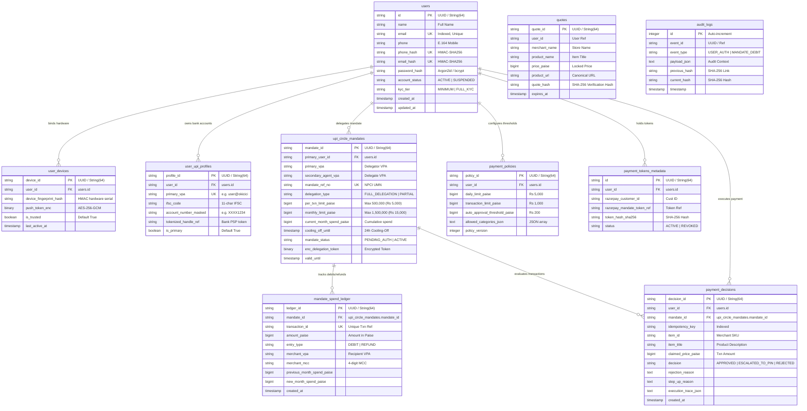

# IntentGuard Database Schemas & Data Dictionary

This document defines the complete relational database schemas, entity-relationship diagrams (ERD), SQL DDL statements, field definitions, and security compliance rules for the **IntentGuard NPCI UPI Circle & Autonomous AI Agent System**.

---

## 1. Schema Overview & Entity Relationships

The IntentGuard database persistence layer manages user identity, trusted device bindings, tokenized bank profiles, NPCI UPI Circle delegation lifecycle, real-time payment decisions, immutable audit hash chains, and spending limits.

### Entity-Relationship Diagram (ERD)



---

## 2. SQL DDL Statements (PostgreSQL / SQLite Compatible)

```sql
-- =====================================================================
-- 1. USERS TABLE
-- =====================================================================
CREATE TABLE IF NOT EXISTS users (
    id VARCHAR(64) PRIMARY KEY,
    name VARCHAR(128) NOT NULL,
    email VARCHAR(128) UNIQUE NOT NULL,
    phone VARCHAR(32),
    address TEXT,
    phone_hash VARCHAR(128) UNIQUE,
    email_hash VARCHAR(128) UNIQUE,
    password_hash VARCHAR(256) NOT NULL,
    account_status VARCHAR(32) DEFAULT 'ACTIVE',
    kyc_tier VARCHAR(32) DEFAULT 'MINIMUM',
    created_at TIMESTAMP DEFAULT CURRENT_TIMESTAMP,
    updated_at TIMESTAMP DEFAULT CURRENT_TIMESTAMP,
    deleted_at TIMESTAMP NULL
);

CREATE INDEX IF NOT EXISTS ix_users_id ON users (id);
CREATE INDEX IF NOT EXISTS ix_users_email ON users (email);
CREATE INDEX IF NOT EXISTS ix_users_phone_hash ON users (phone_hash);
CREATE INDEX IF NOT EXISTS ix_users_email_hash ON users (email_hash);
CREATE INDEX IF NOT EXISTS ix_users_account_status ON users (account_status);

-- =====================================================================
-- 2. USER DEVICES TABLE
-- =====================================================================
CREATE TABLE IF NOT EXISTS user_devices (
    device_id VARCHAR(64) PRIMARY KEY,
    user_id VARCHAR(64) NOT NULL REFERENCES users(id) ON DELETE CASCADE,
    device_fingerprint_hash VARCHAR(128) NOT NULL,
    push_token_enc BYTEA NULL,
    is_trusted BOOLEAN DEFAULT TRUE,
    last_active_at TIMESTAMP DEFAULT CURRENT_TIMESTAMP,
    created_at TIMESTAMP DEFAULT CURRENT_TIMESTAMP,
    updated_at TIMESTAMP DEFAULT CURRENT_TIMESTAMP
);

CREATE INDEX IF NOT EXISTS ix_user_devices_device_id ON user_devices (device_id);
CREATE INDEX IF NOT EXISTS ix_user_devices_user_id ON user_devices (user_id);

-- =====================================================================
-- 3. USER UPI PROFILES TABLE
-- =====================================================================
CREATE TABLE IF NOT EXISTS user_upi_profiles (
    profile_id VARCHAR(64) PRIMARY KEY,
    user_id VARCHAR(64) NOT NULL REFERENCES users(id) ON DELETE CASCADE,
    primary_vpa VARCHAR(128) UNIQUE NOT NULL,
    ifsc_code VARCHAR(11) NOT NULL,
    account_number_masked VARCHAR(16) NOT NULL,
    tokenized_handle_ref VARCHAR(128) NOT NULL,
    is_primary BOOLEAN DEFAULT TRUE,
    created_at TIMESTAMP DEFAULT CURRENT_TIMESTAMP,
    updated_at TIMESTAMP DEFAULT CURRENT_TIMESTAMP
);

CREATE INDEX IF NOT EXISTS ix_user_upi_profiles_profile_id ON user_upi_profiles (profile_id);
CREATE INDEX IF NOT EXISTS ix_user_upi_profiles_user_id ON user_upi_profiles (user_id);
CREATE INDEX IF NOT EXISTS ix_user_upi_profiles_primary_vpa ON user_upi_profiles (primary_vpa);

-- =====================================================================
-- 4. UPI CIRCLE MANDATES TABLE (NPCI LIFECYCLE)
-- =====================================================================
CREATE TABLE IF NOT EXISTS upi_circle_mandates (
    mandate_id VARCHAR(64) PRIMARY KEY,
    primary_user_id VARCHAR(64) NOT NULL REFERENCES users(id) ON DELETE CASCADE,
    primary_vpa VARCHAR(128) NOT NULL,
    secondary_agent_vpa VARCHAR(128) NOT NULL,
    mandate_ref_no VARCHAR(64) UNIQUE NOT NULL,
    delegation_type VARCHAR(32) DEFAULT 'FULL_DELEGATION',
    per_txn_limit_paise BIGINT DEFAULT 500000,
    monthly_limit_paise BIGINT DEFAULT 1500000,
    current_month_spend_paise BIGINT DEFAULT 0,
    last_spend_reset_at TIMESTAMP DEFAULT CURRENT_TIMESTAMP,
    cooling_off_until TIMESTAMP NOT NULL,
    mandate_status VARCHAR(32) DEFAULT 'PENDING_AUTH',
    enc_delegation_token BYTEA NOT NULL,
    valid_from TIMESTAMP DEFAULT CURRENT_TIMESTAMP,
    valid_until TIMESTAMP NOT NULL,
    created_at TIMESTAMP DEFAULT CURRENT_TIMESTAMP,
    updated_at TIMESTAMP DEFAULT CURRENT_TIMESTAMP
);

CREATE INDEX IF NOT EXISTS ix_upi_circle_mandates_mandate_id ON upi_circle_mandates (mandate_id);
CREATE INDEX IF NOT EXISTS ix_upi_circle_mandates_primary_user_id ON upi_circle_mandates (primary_user_id);
CREATE INDEX IF NOT EXISTS ix_upi_circle_mandates_primary_vpa ON upi_circle_mandates (primary_vpa);
CREATE INDEX IF NOT EXISTS ix_upi_circle_mandates_secondary_agent_vpa ON upi_circle_mandates (secondary_agent_vpa);
CREATE INDEX IF NOT EXISTS ix_upi_circle_mandates_mandate_status ON upi_circle_mandates (mandate_status);

-- =====================================================================
-- 5. MANDATE SPEND LEDGER TABLE
-- =====================================================================
CREATE TABLE IF NOT EXISTS mandate_spend_ledger (
    ledger_id VARCHAR(64) PRIMARY KEY,
    mandate_id VARCHAR(64) NOT NULL REFERENCES upi_circle_mandates(mandate_id) ON DELETE CASCADE,
    transaction_id VARCHAR(64) UNIQUE NOT NULL,
    amount_paise BIGINT NOT NULL,
    entry_type VARCHAR(32) DEFAULT 'DEBIT',
    merchant_vpa VARCHAR(128) NOT NULL,
    merchant_mcc VARCHAR(8) NOT NULL,
    previous_month_spend_paise BIGINT DEFAULT 0,
    new_month_spend_paise BIGINT DEFAULT 0,
    created_at TIMESTAMP DEFAULT CURRENT_TIMESTAMP
);

CREATE INDEX IF NOT EXISTS ix_mandate_spend_ledger_ledger_id ON mandate_spend_ledger (ledger_id);
CREATE INDEX IF NOT EXISTS ix_mandate_spend_ledger_mandate_id ON mandate_spend_ledger (mandate_id);
CREATE INDEX IF NOT EXISTS ix_mandate_spend_ledger_created_at ON mandate_spend_ledger (created_at);

-- =====================================================================
-- 6. PAYMENT DECISIONS TABLE (PDE VERDICTS & TRACES)
-- =====================================================================
CREATE TABLE IF NOT EXISTS payment_decisions (
    decision_id VARCHAR(64) PRIMARY KEY,
    user_id VARCHAR(64) REFERENCES users(id) ON DELETE SET NULL,
    mandate_id VARCHAR(64) REFERENCES upi_circle_mandates(mandate_id) ON DELETE SET NULL,
    session_id VARCHAR(64) NULL,
    idempotency_key VARCHAR(128) NOT NULL,
    item_id VARCHAR(64) NOT NULL,
    item_title VARCHAR(256) NOT NULL,
    claimed_price_paise BIGINT NOT NULL,
    merchant_vpa VARCHAR(128) NOT NULL,
    merchant_mcc VARCHAR(8) NOT NULL,
    decision VARCHAR(32) NOT NULL,
    rejection_reason TEXT NULL,
    step_up_reason TEXT NULL,
    execution_trace_json TEXT NULL,
    created_at TIMESTAMP DEFAULT CURRENT_TIMESTAMP
);

CREATE INDEX IF NOT EXISTS ix_payment_decisions_decision_id ON payment_decisions (decision_id);
CREATE INDEX IF NOT EXISTS ix_payment_decisions_user_id ON payment_decisions (user_id);
CREATE INDEX IF NOT EXISTS ix_payment_decisions_mandate_id ON payment_decisions (mandate_id);
CREATE INDEX IF NOT EXISTS ix_payment_decisions_idempotency_key ON payment_decisions (idempotency_key);
CREATE INDEX IF NOT EXISTS ix_payment_decisions_decision ON payment_decisions (decision);
CREATE INDEX IF NOT EXISTS ix_payment_decisions_created_at ON payment_decisions (created_at);

-- =====================================================================
-- 7. PAYMENT POLICIES TABLE
-- =====================================================================
CREATE TABLE IF NOT EXISTS payment_policies (
    policy_id VARCHAR(64) PRIMARY KEY,
    user_id VARCHAR(64) NOT NULL REFERENCES users(id) ON DELETE CASCADE,
    daily_limit_paise BIGINT DEFAULT 500000,
    transaction_limit_paise BIGINT DEFAULT 100000,
    auto_approval_threshold_paise BIGINT DEFAULT 20000,
    allowed_categories_json TEXT DEFAULT '["apparel", "electronics", "food", "recharge"]',
    policy_version INTEGER DEFAULT 1,
    updated_at TIMESTAMP DEFAULT CURRENT_TIMESTAMP
);

CREATE INDEX IF NOT EXISTS ix_payment_policies_policy_id ON payment_policies (policy_id);

-- =====================================================================
-- 8. PAYMENT TOKENS METADATA TABLE
-- =====================================================================
CREATE TABLE IF NOT EXISTS payment_tokens_metadata (
    id VARCHAR(64) PRIMARY KEY,
    user_id VARCHAR(64) NOT NULL REFERENCES users(id) ON DELETE CASCADE,
    razorpay_customer_id VARCHAR(128) NOT NULL,
    razorpay_mandate_token_ref VARCHAR(128) NOT NULL,
    token_hash_sha256 VARCHAR(128) NOT NULL,
    status VARCHAR(32) DEFAULT 'ACTIVE',
    created_at TIMESTAMP DEFAULT CURRENT_TIMESTAMP
);

CREATE INDEX IF NOT EXISTS ix_payment_tokens_metadata_id ON payment_tokens_metadata (id);

-- =====================================================================
-- 9. QUOTES TABLE
-- =====================================================================
CREATE TABLE IF NOT EXISTS quotes (
    quote_id VARCHAR(64) PRIMARY KEY,
    user_id VARCHAR(64) NOT NULL,
    merchant_name VARCHAR(128) NOT NULL,
    product_name VARCHAR(256) NOT NULL,
    price_paise BIGINT NOT NULL,
    product_url TEXT NOT NULL,
    expires_at TIMESTAMP NOT NULL,
    quote_hash VARCHAR(128) NOT NULL,
    created_at TIMESTAMP DEFAULT CURRENT_TIMESTAMP
);

CREATE INDEX IF NOT EXISTS ix_quotes_quote_id ON quotes (quote_id);

-- =====================================================================
-- 10. AUDIT LOGS TABLE (TAMPER-EVIDENT HASH CHAIN)
-- =====================================================================
CREATE TABLE IF NOT EXISTS audit_logs (
    id SERIAL PRIMARY KEY,
    event_id VARCHAR(64),
    event_type VARCHAR(64) NOT NULL,
    payload_json TEXT NOT NULL,
    previous_hash VARCHAR(128) NOT NULL,
    current_hash VARCHAR(128) NOT NULL,
    timestamp TIMESTAMP DEFAULT CURRENT_TIMESTAMP
);

CREATE INDEX IF NOT EXISTS ix_audit_logs_event_id ON audit_logs (event_id);
```

---

## 3. Data Dictionary

### 3.1 `users` Table
Stores registered user identities, authentication credentials, and compliance tiers.

| Field Name | Type | Nullable | Primary/Foreign Key | Description / Constraints |
|---|---|---|---|---|
| `id` | VARCHAR(64) | No | PK | Unique user identifier (UUID v4) |
| `name` | VARCHAR(128) | No | - | User's full legal name |
| `email` | VARCHAR(128) | No | Unique, Indexed | User email address |
| `phone` | VARCHAR(32) | Yes | - | E.164 formatted mobile number (e.g. `+919876543210`) |
| `address` | TEXT | Yes | - | Primary shipping/delivery address |
| `phone_hash` | VARCHAR(128) | Yes | Unique, Indexed | HMAC-SHA256 of mobile number for zero-trust lookups |
| `email_hash` | VARCHAR(128) | Yes | Unique, Indexed | HMAC-SHA256 of email address |
| `password_hash` | VARCHAR(256) | No | - | Secure password hash (Argon2id / bcrypt) |
| `account_status` | VARCHAR(32) | No | Indexed | Status: `ACTIVE`, `SUSPENDED`, `BLOCKED` |
| `kyc_tier` | VARCHAR(32) | No | - | NPCI KYC level: `MINIMUM`, `FULL_KYC` |
| `created_at` | TIMESTAMP | No | - | Record creation timestamp (UTC) |
| `updated_at` | TIMESTAMP | No | - | Last profile update timestamp (UTC) |
| `deleted_at` | TIMESTAMP | Yes | - | Soft-deletion timestamp |

---

### 3.2 `upi_circle_mandates` Table
Tracks delegated NPCI UPI Circle authorization lifecycle, cumulative spend, and cooling-off timers.

| Field Name | Type | Nullable | Key / Index | Description / NPCI Rule |
|---|---|---|---|---|
| `mandate_id` | VARCHAR(64) | No | PK | Mandate primary key |
| `primary_user_id` | VARCHAR(64) | No | FK (`users.id`) | Primary account owner delegating authority |
| `primary_vpa` | VARCHAR(128) | No | Indexed | Delegator VPA (e.g. `sanjay@okicici`) |
| `secondary_agent_vpa` | VARCHAR(128) | No | Indexed | Authorized AI agent VPA (e.g. `agent.antigravity@psp`) |
| `mandate_ref_no` | VARCHAR(64) | No | Unique | NPCI Unique Mandate Number (UMN) |
| `delegation_type` | VARCHAR(32) | No | - | Mode: `FULL_DELEGATION` (Pinless) or `PARTIAL_DELEGATION` (Pin-required) |
| `per_txn_limit_paise` | BIGINT | No | - | Max per-txn limit in paise (NPCI Hard Cap: ₹5,000 / 500,000 paise) |
| `monthly_limit_paise` | BIGINT | No | - | Max monthly limit in paise (NPCI Hard Cap: ₹15,000 / 1,500,000 paise) |
| `current_month_spend_paise` | BIGINT | No | - | Cumulative spent paise in current 30-day billing cycle |
| `last_spend_reset_at` | TIMESTAMP | No | - | Timestamp when monthly cumulative counter was last reset |
| `cooling_off_until` | TIMESTAMP | No | - | UTC timestamp marking end of 24h NPCI cooling-off period |
| `mandate_status` | VARCHAR(32) | No | Indexed | Mandate status: `PENDING_AUTH`, `ACTIVE`, `PAUSED`, `REVOKED`, `EXPIRED` |
| `enc_delegation_token` | BYTEA | No | - | AES-256-GCM encrypted bank PSP delegation token |
| `valid_from` | TIMESTAMP | No | - | Start of mandate validity window |
| `valid_until` | TIMESTAMP | No | - | Expiration of mandate validity window |

---

### 3.3 `mandate_spend_ledger` Table
Immutable ledger of all debits and refunds executed under a mandate.

| Field Name | Type | Nullable | Key / Index | Description |
|---|---|---|---|---|
| `ledger_id` | VARCHAR(64) | No | PK | Ledger entry identifier |
| `mandate_id` | VARCHAR(64) | No | FK (`upi_circle_mandates`) | Parent mandate reference |
| `transaction_id` | VARCHAR(64) | No | Unique | External gateway / NPCI transaction reference |
| `amount_paise` | BIGINT | No | - | Transaction amount in paise |
| `entry_type` | VARCHAR(32) | No | - | Transaction type: `DEBIT`, `REFUND`, `ADJUSTMENT` |
| `merchant_vpa` | VARCHAR(128) | No | - | Merchant VPA destination |
| `merchant_mcc` | VARCHAR(8) | No | - | Merchant Category Code (4 digits) |
| `previous_month_spend_paise` | BIGINT | No | - | Cumulative month spend before this debit |
| `new_month_spend_paise` | BIGINT | No | - | Cumulative month spend after this debit |
| `created_at` | TIMESTAMP | No | Indexed | Execution timestamp |

---

### 3.4 `payment_decisions` Table
Audit table recording all verdicts, risk evaluations, and execution traces evaluated by the Payment Decision Engine (PDE).

| Field Name | Type | Nullable | Key / Index | Description |
|---|---|---|---|---|
| `decision_id` | VARCHAR(64) | No | PK | Unique decision identifier |
| `user_id` | VARCHAR(64) | Yes | FK (`users.id`) | Requesting user |
| `mandate_id` | VARCHAR(64) | Yes | FK (`upi_circle_mandates`) | Evaluated mandate |
| `session_id` | VARCHAR(64) | Yes | - | Active user session ID |
| `idempotency_key` | VARCHAR(128) | No | Indexed | Deduplication key |
| `item_id` | VARCHAR(64) | No | - | Product SKU or cart identifier |
| `item_title` | VARCHAR(256) | No | - | Item description |
| `claimed_price_paise` | BIGINT | No | - | Transaction price in paise |
| `merchant_vpa` | VARCHAR(128) | No | - | Target merchant VPA |
| `merchant_mcc` | VARCHAR(8) | No | - | Target merchant MCC |
| `decision` | VARCHAR(32) | No | Indexed | Verdict: `APPROVED`, `ESCALATED_TO_PIN`, `REJECTED` |
| `rejection_reason` | TEXT | Yes | - | Detailed reason for REJECTED verdict |
| `step_up_reason` | TEXT | Yes | - | Cause for step-up PIN authorization |
| `execution_trace_json` | TEXT | Yes | - | Full JSON trace of risk rules evaluated |
| `created_at` | TIMESTAMP | No | Indexed | Evaluation timestamp |

---

## 4. Security & Compliance Rules

> [!IMPORTANT]
> **NPCI & PCI-DSS Compliance Guidelines**
>
> 1. **Zero Raw PIN Storage**: 4-digit and 6-digit UPI PINs must **NEVER** be persisted to any database table, log file, cache, or permanent storage. PINs are submitted directly to bank PSP SDKs in memory only.
> 2. **NPCI Hard Limits**:
>    - **Per-Transaction Cap**: Maximum ₹5,000 (500,000 paise) per autonomous transaction. Transactions above ₹5,000 **MUST** step up to explicit user UPI PIN entry.
>    - **Monthly Cumulative Cap**: Maximum ₹15,000 (1,500,000 paise) cumulative monthly spend. Transactions pushing the total above ₹15,000 **MUST** be rejected ($400$ Bad Request).
>    - **24-Hour Cooling-Off Period**: During the first 24 hours after mandate authorization, transactions $\le$ ₹2,000 are approved automatically; transactions $>$ ₹2,000 require explicit UPI PIN step-up.
> 3. **Tamper-Evident Audit Logging**: The `audit_logs` table employs SHA-256 cryptographic hash chaining (`current_hash = SHA256(previous_hash + payload)`). Any modification to historic logs breaks the hash chain verification.
